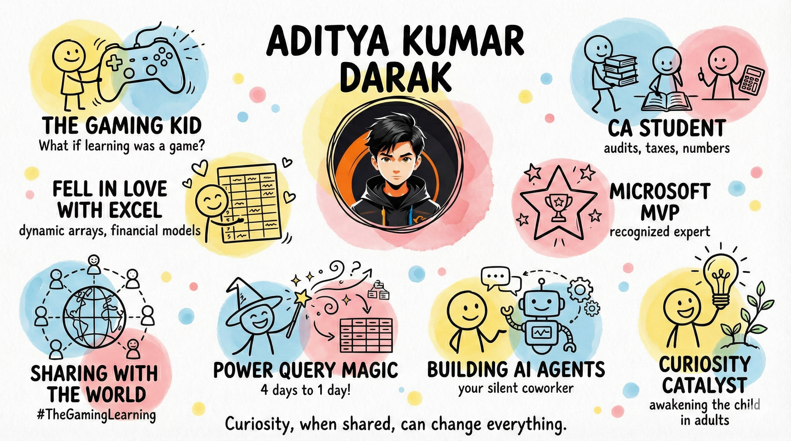

<!-- ===== HEADER TIMELINE ===== -->

  

 

<!-- ===== TYPING SVG ===== -->

  

<!-- ===== PROFILE VIEWS ===== -->

  

---

## Hey there 👋,

I transform financial processes using AI, build financial models with dynamic arrays in Excel, and automate complex processes using Power Query at **Profectus**.

But behind the job title, there's one thing I chase relentlessly: **Curiosity**.

<b>What I Do (and Why I Love It)</b>

You know those repetitive finance tasks in spreadsheets that make professionals want to scream loudly?

I help automate them using tools like **ChatGPT, Excel, Power Query, and AI agents**, so decision-making becomes faster and a lot less frustrating.

I'm also learning how to build financial models for investment banking, financial institutions, and the banking industry using dynamic arrays. It's not just about the thrill of numbers, but about making forecasting smarter and more flexible for quick decisions.

> You can say I love projecting numbers and doing predictive and diagnostic analytics.

For me, automation and AI aren't about replacing people.
They're about giving them **breathing room**: to think, to imagine, and to solve better.

And when it comes to tools like Excel, Power Query or Python?
I know they seem intimidating at first.
That's why I love teaching them in the most human, relatable way (sometimes even the **gaming way**), where people actually *get it* without feeling overwhelmed.

<b>What am I doing these days</b>

Lately, I've been experimenting with:

- How finance teams can use **Agentic AI** to automate the boring and focus on real decisions
- Making learning **playful**, even when it's about analytics and AI
- Creating **AI workflows** that think ahead, like a silent coworker who always has your back

I find myself somewhere in the middle of spreadsheets, code, curiosity, and imagination.

<b>Let's Stay Curious, Together</b>

If you've ever asked, *"What if we didn't do it the same old way?"*, then you're my kind of person.

Because I truly believe every child is unique. But as we grow up, that child often fades away, and along with it, the curiosity and excitement to keep learning.

**I'm on a mission to awaken that child in those adults.**

Whether you're in finance, data, or just someone who loves exploring new ideas, I'd love to connect.

> *Because curiosity, when shared, can change everything.*

Let's keep asking. Let's keep exploring. Let's grow together.

---

## What I Work With

<!-- Row 1: Core domains -->

  
  &nbsp;
  
  &nbsp;
  

<!-- Row 2: Tools -->

  
  &nbsp;
  
  &nbsp;
  
  &nbsp;
  
  &nbsp;
  

---

## GitHub Stats

<!-- Streak Stats -->

  <picture>
    <source
      media="(prefers-color-scheme: dark)"
      srcset="https://streak-stats.demolab.com/?user=Hermione-Granger-1176&theme=github-dark-blue&hide_border=true&background=0d1117&ring=FFD100&fire=FFD100&currStreakLabel=FFD100&sideLabels=FFD100&currStreakNum=FFD100&sideNums=FFD100&dates=888888"
    />
    <source
      media="(prefers-color-scheme: light)"
      srcset="https://streak-stats.demolab.com/?user=Hermione-Granger-1176&theme=default&hide_border=true&ring=D4A800&fire=FFD100&currStreakLabel=000000&sideLabels=000000&currStreakNum=000000&sideNums=000000&dates=888888"
    />
    
  </picture>

<!-- Activity Graph -->

  <picture>
    <source
      media="(prefers-color-scheme: dark)"
      srcset="https://github-readme-activity-graph.vercel.app/graph?username=Hermione-Granger-1176&bg_color=0d1117&color=FFD100&title_color=FFD100&line=FFD100&point=FFD100&area_color=FFD100&area=true&hide_border=true"
    />
    <source
      media="(prefers-color-scheme: light)"
      srcset="https://github-readme-activity-graph.vercel.app/graph?username=Hermione-Granger-1176&bg_color=ffffff&color=000000&title_color=000000&line=FFD100&point=D4A800&area_color=FFD100&area=true&hide_border=true"
    />
    
  </picture>

---

## Contribution Snake

  <picture>
    <source
      media="(prefers-color-scheme: dark)"
      srcset="https://raw.githubusercontent.com/Hermione-Granger-1176/Hermione-Granger-1176/main/assets/github-snake-dark.svg"
    />
    <source
      media="(prefers-color-scheme: light)"
      srcset="https://raw.githubusercontent.com/Hermione-Granger-1176/Hermione-Granger-1176/main/assets/github-snake.svg"
    />
    
  </picture>

<!-- Snake caption: dark text for light mode, gold for dark mode -->

  <picture>
    <source
      media="(prefers-color-scheme: dark)"
      srcset="https://readme-typing-svg.demolab.com?font=Fira+Code&weight=500&size=14&pause=1500&color=FFD100&center=true&vCenter=true&repeat=true&width=500&height=30&lines=The+snake+eats+my+contribution+graph+daily...;...and+it+keeps+coming+back+for+more!;nom+nom+nom+nom+nom..."
    />
    <source
      media="(prefers-color-scheme: light)"
      srcset="https://readme-typing-svg.demolab.com?font=Fira+Code&weight=500&size=14&pause=1500&color=000000&center=true&vCenter=true&repeat=true&width=500&height=30&lines=The+snake+eats+my+contribution+graph+daily...;...and+it+keeps+coming+back+for+more!;nom+nom+nom+nom+nom..."
    />
    
  </picture>

---

## Connect With Me

  
  &nbsp;
  
  &nbsp;
  
  &nbsp;
  
  &nbsp;
  

 

  <i>"Every child is unique. I'm on a mission to awaken that child in adults."</i>

